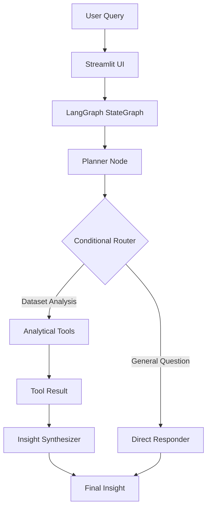

# Insight Copilot — LangGraph Architecture Specification

This document details the architectural design, state management, node lifecycle, and conditional routing mechanism of **Insight Copilot**.

---

## 1. System Architecture Diagram

---

## 2. Component Explanations

### A. Typed Agent State (`AgentState`)
Defined in `agent/state.py` using Python's `TypedDict`:
- `user_query` *(str)*: Natural language input prompt from the user.
- `messages` *(List[Dict])*: Multi-turn conversation history.
- `reasoning_plan` *(Optional[str])*: User-facing plan detailing WHAT the agent plans to do.
- `requires_tool` *(bool)*: Boolean flag set by the planner to direct routing.
- `selected_tool` *(Optional[str])*: Chosen tool name (`query_dataset`, `calculate_statistics`, `generate_visualization`, `get_schema_and_summary`).
- `tool_arguments` *(Optional[Dict])*: Parameters passed to the selected tool.
- `tool_result` *(Optional[Dict])*: Execution output from the analytical tool.
- `visualization` *(Optional[Dict])*: Plotly chart specification.
- `final_insight` *(Optional[Dict])*: Structured output containing `direct_answer`, `supporting_numbers`, and `why_this_matters`.

### B. Planner Node (`planner_node`)
The `planner_node` is the first node executed in the LangGraph workflow:
1. Evaluates the user query and multi-turn context.
2. Formulates a concise user-facing plan (e.g., *"1. Query sales by region. 2. Calculate profit margin. 3. Summarize key drivers."*).
3. Selects the target analytical tool and validates parameter schemas.
4. Updates `reasoning_plan`, `requires_tool`, `selected_tool`, and `tool_arguments` in `AgentState`.

### C. Conditional Router Edge (`route_after_planner`)
A true LangGraph conditional edge inspecting `state["requires_tool"]`:
- If `requires_tool == True`: Routes execution to `tool_runner_node`.
- If `requires_tool == False`: Routes execution to `direct_responder_node`.

### D. Analytical Tools (`tool_runner_node`)
Executes analytical tools against `data/SuperStore_Sales_Dataset.csv`:
- `query_dataset`: Multi-column grouping, filtering, sorting, top-N metrics.
- `calculate_statistics`: YoY growth rates, regional profit margin analysis, z-score anomaly detection.
- `generate_visualization`: Dynamic Plotly chart builder.
- `get_schema_and_summary`: Schema metadata explorer & KPI overview.

### E. Insight Synthesizer (`synthesizer_node`)
Transforms raw Pandas outputs into an analyst-style response structure:
- **Answer**: Direct, clear response to the user's question.
- **Supporting Numbers**: Bullet points of calculated empirical numbers.
- **Why This Matters**: High-level business takeaway.

### F. Direct Responder (`direct_responder_node`)
Handles non-data queries (greetings, system capability questions, out-of-scope prompts) directly without running unnecessary dataset calculations.

### G. Streamlit UI & Multi-Turn Conversation
`app.py` maintains state across turns using `st.session_state.messages`:
- Displays chat history.
- Renders the collapsible **📋 Agent Plan** section.
- Renders **Answer**, **Supporting Numbers**, **Why This Matters**, and interactive Plotly charts.
- Provides a dataset sidebar showing total records (5,901) and baseline KPIs.
