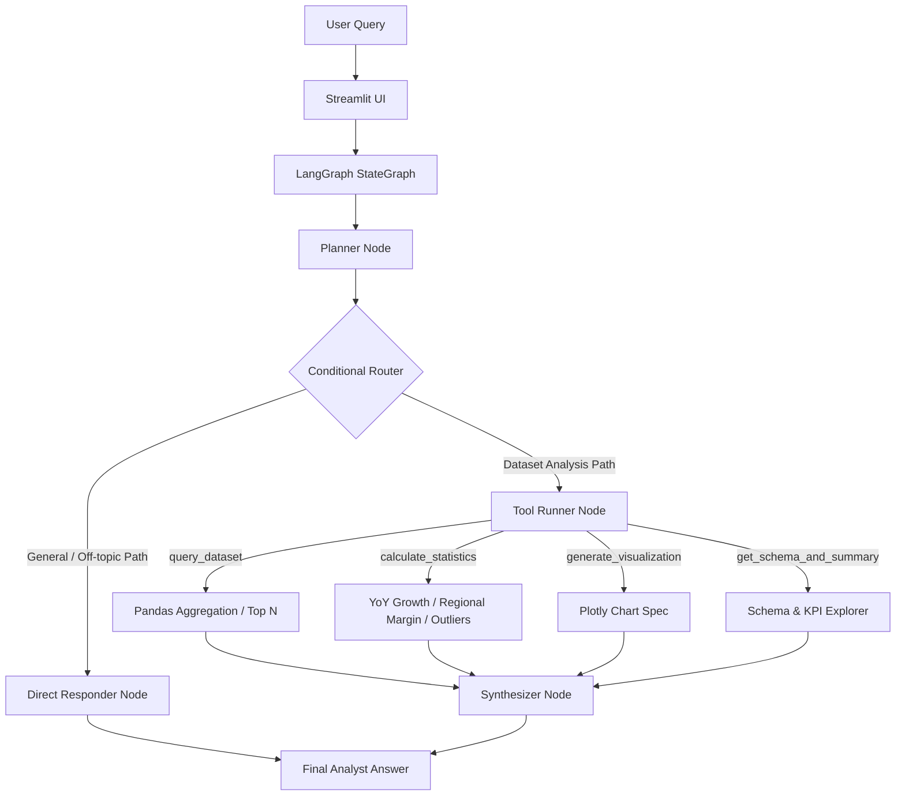

# Insight Copilot — LangGraph Reasoning Analyst Chatbot

> **Gen AI / LLM / Agentic AI Internship Assignment**  
> *Build a Reasoning, Tool-Using Insight Chatbot with LangGraph*

**Insight Copilot** is a natural language data analyst chatbot orchestrated using **LangGraph StateGraph**. Given user questions about the real **Global SuperStore Sales Dataset** (`data/SuperStore_Sales_Dataset.csv`), it articulates a clear user-facing plan, routes the query through a conditional edge, executes specialized analytical tools (Pandas queries, statistical calculations, Plotly charts), and synthesizes direct answers with supporting numbers and business takeaways.

---

## 📋 Problem Statement & Objective

Traditional AI chatbots often return raw text dumps or unvalidated hallucinated figures when asked data analysis questions. **Insight Copilot** addresses this by introducing a multi-step agentic workflow using **LangGraph StateGraph** that enforces empirical data execution before synthesizing insights.

**Key Objectives:**
- Design a LangGraph state machine with typed state (`AgentState`), nodes, and real conditional edge routing.
- Expose a user-facing **Agent Plan** detailing WHAT the agent plans to do before taking action.
- Provide 4 distinct analytical tools (Data Query, Statistical Calculator, Plotly Visualizer, Schema Explorer).
- Deliver structured analyst answers: **Answer**, **Supporting Numbers**, and **Why This Matters**.

---

## 🛠️ Technology Stack & Dataset Source

- **Language & Frameworks**: Python, Streamlit, LangGraph StateGraph, Pandas, Plotly.
- **Primary LLM Provider**: Google Gemini (`GEMINI_API_KEY` / `GOOGLE_API_KEY`).
- **Local Fallback Engine**: Lightweight deterministic rule engine for development/testing when no API key is present (explicitly labeled as a heuristic engine).
- **Real Dataset Source**: `data/SuperStore_Sales_Dataset.csv` (5,901 real order records from 2019 to 2020 across 4 US regions, 3 categories, and 17 sub-categories).

---

## 🏗️ Architecture & LangGraph Flowchart



---

## 📂 Project Structure

```
AI_Project/
│
├── data/
│   └── SuperStore_Sales_Dataset.csv  # Real SuperStore dataset (5,901 rows)
│
├── agent/
│   ├── __init__.py
│   ├── state.py                      # Typed AgentState definition
│   ├── tools.py                      # 4 Analytical Tools (Pandas, Stats, Plotly, Schema)
│   ├── llm.py                        # Primary LLM Adapter & Local Fallback Engine
│   └── graph.py                      # LangGraph StateGraph, Nodes & Conditional Edge
│
├── tests/
│   └── test_agent.py                 # Automated verification test suite
│
├── app.py                            # Streamlit web application frontend
├── requirements.txt                  # Dependency specifications
├── README.md                         # Project documentation
├── ARCHITECTURE.md                   # LangGraph StateGraph architectural breakdown
└── WRITEUP.md                        # Assignment design decisions write-up
```

---

## 🚀 Quickstart & Local Execution

### 1. Prerequisites
- Python 3.10+
- `pip`

### 2. Installation
Clone the repository and install requirements:

```bash
git clone https://github.com/your-username/insight-copilot.git
cd insight-copilot

pip install -r requirements.txt
```

### 3. Environment Variable Setup (Optional)
To enable live LLM generation, set your Gemini API key:

**Linux / macOS:**
```bash
export GEMINI_API_KEY="your-gemini-api-key"
```

**Windows (PowerShell):**
```powershell
$env:GEMINI_API_KEY="your-gemini-api-key"
```

### 4. Run the Streamlit Application

```bash
streamlit run app.py
```

Open your browser at `http://localhost:8501`.

### 5. Run Verification Test Suite

```bash
python tests/test_agent.py
```

---

## 💬 Example Questions

1. 🛍️ *"What were the top 5 products by sales?"* (Uses `query_dataset`)
2. 📈 *"Is there a seasonal trend in sales?"* (Uses `calculate_statistics`)
3. 🌎 *"Compare West and East region performance and explain what's driving the difference."* (Uses `calculate_statistics`)
4. ⚠️ *"Summarize anything unusual in this data."* (Uses `calculate_statistics`)
5. 📋 *"What columns are available in the dataset?"* (Uses `get_schema_and_summary`)
6. 👋 *"Hello, who are you?"* (Routes to `direct_responder`)

---

## ⚙️ Analytical Tools Description

1. **`query_dataset`**: Grouping, filtering, sorting, and aggregate calculations (sum, mean, order count) across dimensions like Category, Sub-Category, Region, and Product Name.
2. **`calculate_statistics`**: Mathematical calculations including YoY growth rates, regional profit margin analysis, z-score anomaly detection, and correlation metrics.
3. **`generate_visualization`**: Prepares Plotly bar, line, and scatter chart specifications for interactive Streamlit rendering.
4. **`get_schema_and_summary`**: Provides schema details, column types, row counts, missing value audits, and core KPIs.

---

## ☁️ Deployment Instructions (Streamlit Community Cloud)

1. Push the repository to GitHub (ensure `data/SuperStore_Sales_Dataset.csv` is included).
2. Visit [share.streamlit.io](https://share.streamlit.io).
3. Connect your GitHub repository, setting `Main file path` to `app.py`.
4. In **Advanced Settings / Secrets**, optionally configure:
   ```toml
   GEMINI_API_KEY = "your-api-key"
   ```
5. Click **Deploy**.

---

## ⚠️ Limitations & Future Improvements

- **Limitations**:
  - The dataset covers 2 full years (2019-2020) of US transaction data.
  - Queries are limited to the dimensions present in the CSV file.
- **Future Improvements**:
  - Integrate a text-to-SQL compiler with DuckDB/SQLite for complex ad-hoc SQL joins.
  - Add multi-agent collaboration with dedicated specialized sub-agents.
